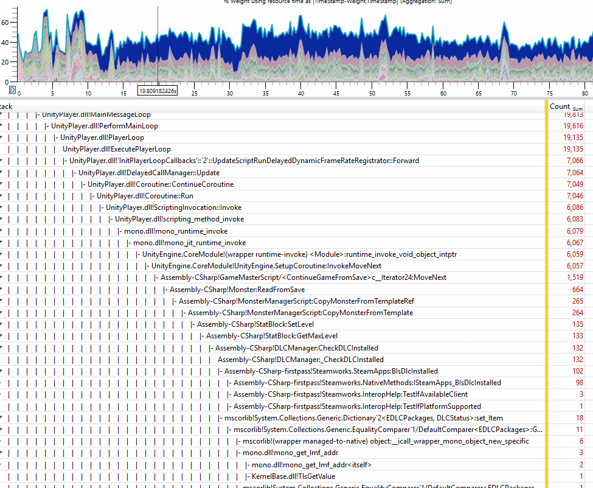

# UnityEtwSymbols
Hack the Mono runtime to emit JIT symbol mapping ETW events, have xperf in *your* Unity! Capture low overhead sampling performance profiling stack traces that span the Unity engine, the Mono runtime, your jitted .NET code, and even the Windows kernel!

# How to do it

1. Replace Unity's mono.dll with the appropriately altered matching mono.dll (2018.2 v3.5 runtime provided; all other version left as an exercise for the reader)
2. **Before launching your program**, start recording a trace using xperf from the Windows Performance Toolkit: `xperf -on Base -Stackwalk Profile -start MonoSymbolTrace -on Microsoft-JScript`.
3. *Now* you can start it. Do your thing.
4. Stop & save the trace: `xperf -stop -stop MonoSymbolTrace -d MyUnityTrace.etl`
5. Open up your shiny new etl file in Windows Performance Analyzer. Add `http://symbolserver.unity3d.com/` to your symbol path for Unity player symbols, and make sure it can find the mono.pdb that matches your mono.dll too.

# Wait, "Microsoft-JScript"?

There are four ETW providers that WPA knows how to translate into symbols for jitted code: Microsoft-Windows-DotNetRuntime, Microsoft-JScript, WARP, and VPC. The only thing I know about the WARP and VPC providers is their GUID (I don't even know their actual names!), so they're out. DotNetRuntime seems the obvious choice for Mono - but the JScript events are much less complex and easy for me to test behaviors against so I picked it for an easier proof-of-concept.

# And needing to start recording the trace first?

I haven't implemented any of the data collection start/end rundown events - the assembly load & jit compile events get emitted once, when they happen, and if you aren't listening at the time, they're gone.
